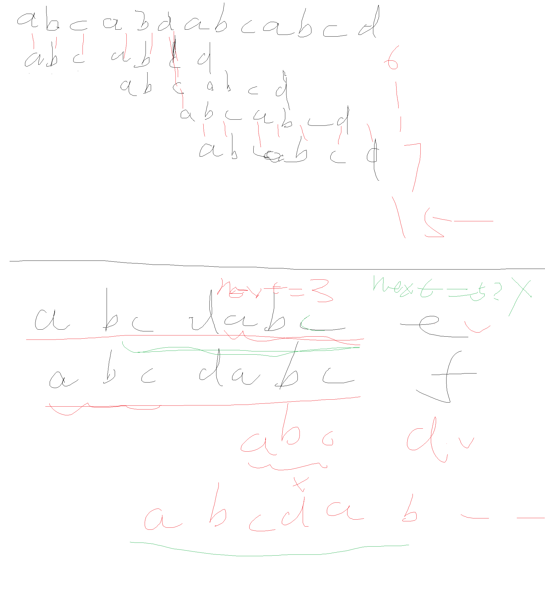
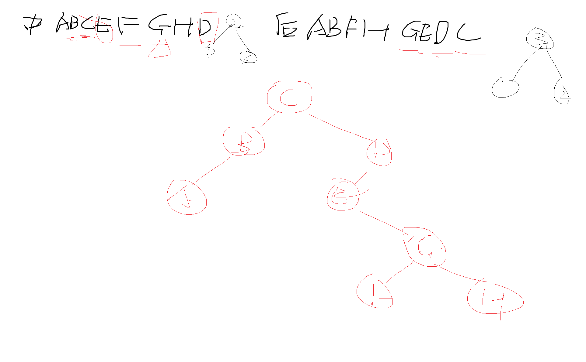
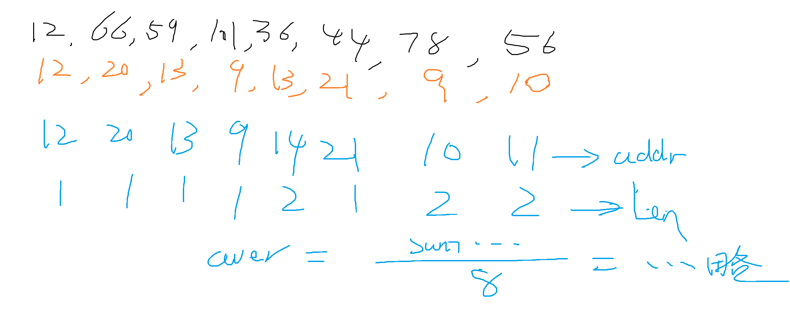
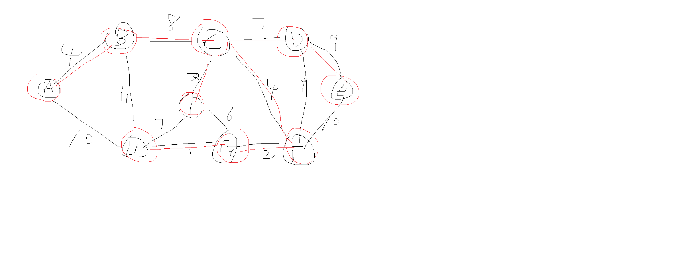
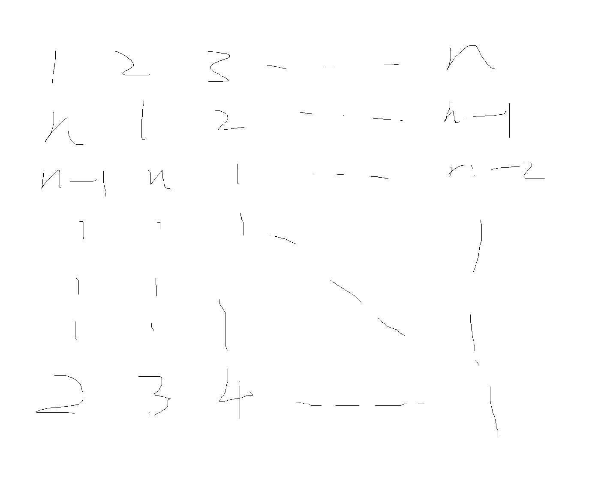
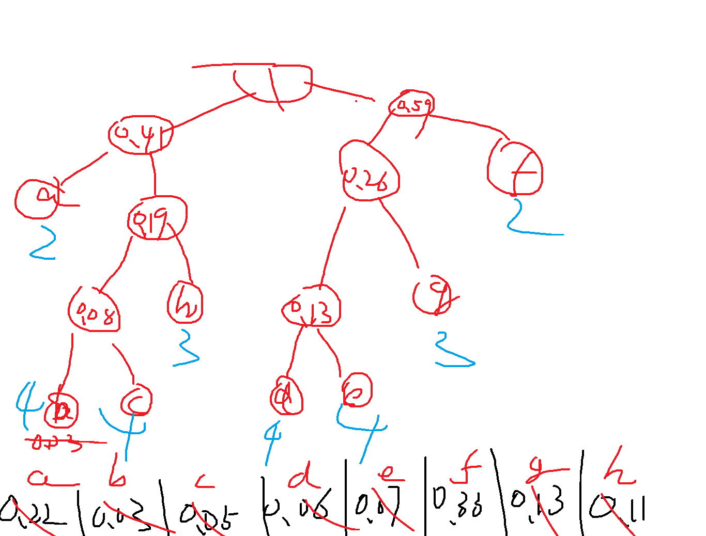
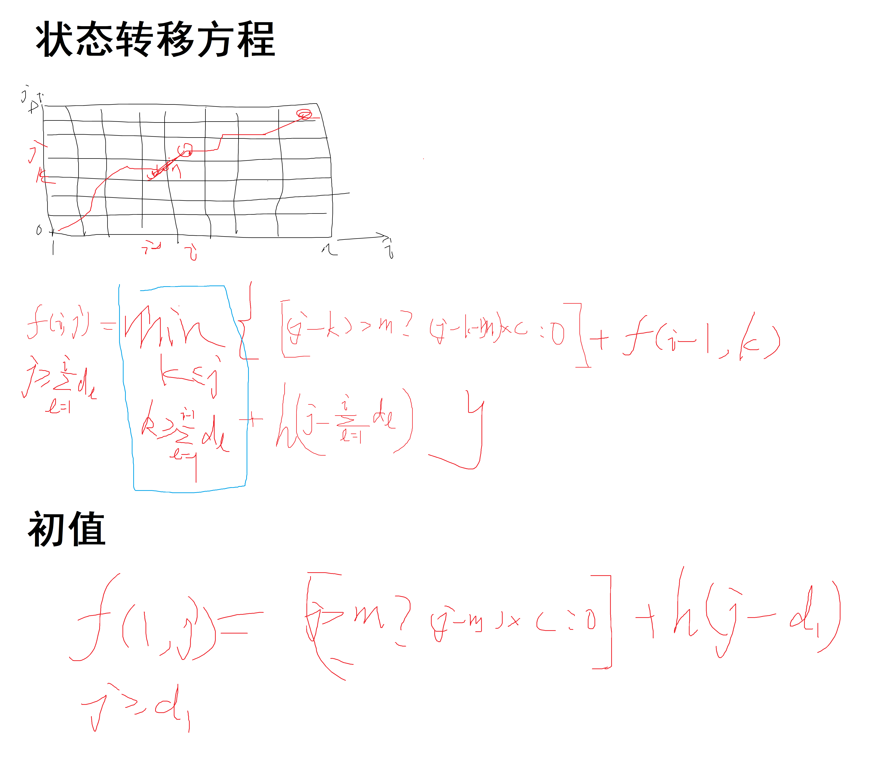

# Lecture

## 数据与算法小班辅导 20230217

---

刘雪枫 - 无 92

Copyright (C) Timothy Liu 2023

许可证：[Creative Commons — 署名-相同方式共享 4.0 国际 — CC BY-SA 4.0](https://creativecommons.org/licenses/by-sa/4.0/deed.zh-Hans)

2023.02.17

---

## 目录

[TOC]

## 2014

### 一、填空题

1. T1 < T3 < T6 < T2 < T4 < T5

2. TAGLAROATMHID；AL\*G\*O\*\*

3. $n\log n$；$n^2$

4. 略

5. 参见陈健生老师数算课件《算法设计基础》

6. 8；240；239；9

   > 需要用到真二叉树的性质：非叶子结点数=叶子结点数-1（归纳法可证）；
   >
   > **真二叉树；**每个结点的度为0或2，不存在度为1的结点
   >
   > **完全二叉树：**最后一层叶子节点靠左，其他层是满的
   >
   > **满二叉树**：所有层都是满的
   >
   > 注意要求非连通图，因此答案在8的基础上加1，答案是9


### 二、计算

1. KMP 算法

   Next：0 0 0 1 2 3 0；15（？）

   > 寻找部分匹配串长度，根据定义即可；匹配过程慢慢推
   >
   > 

2. 二叉树遍历与恢复

   > 注意，前序和后序不能得出中序遍历序列；
   > 中序和前/后序能得出后/前序，原理：通过前/后序得出根节点，通过中序得出左右子树 

   

   前序：CBADEGFH

3. 开放定址：

   > ```python
   > l = (12, 66, 59, 101, 36, 44, 78, 56)
   > list(k % 23 for k in l)
   > ```
   >
   > \[12, 20, 13, 9, 13, 21, 9, 10\]

   

4. 参考微积分 A (1)，略

5. 数值分析，略

6. 拉格朗日插值公式，牛顿插值，或用二次函数待定系数法（九年级数学，但貌似不得分 x），或用直觉法（貌似也不得分 x），显然易得答案为 $x^2$

### 三、程序填空

`5_9_x_6_2_x_-_70_+_8_x`；

`s.push(s.pop() * s.pop())`；

`s.push(-s.pop() + s.pop())`；

`(a[i] >= '0') && (a[i] <= '9')`；

`s.push(s.pop() * 10 + (a[i] - '0'))`

> + `s.push(-s.pop() + s.pop())` 中，本质上两个 `pop` 的执行顺序是未指定的，这将产生未定义行为，但这里我们假设左操作数先被求值：
>   + [Order of evaluation - cppreference.com](https://en.cppreference.com/w/cpp/language/eval_order)
>   + [[intro.execution\] (timsong-cpp.github.io)](https://timsong-cpp.github.io/cppwp/n4861/intro.execution#8)
>   + [p0145r3.pdf (open-std.org)](https://www.open-std.org/jtc1/sc22/wg21/docs/papers/2016/p0145r3.pdf)
> + `(a[i] >= '0') && (a[i] <= '9')` 是与题干的写法保持一致。在日常写代码中也可以用 `<cctype>` 或 `<ctype.h>` 中的 `std::isdigit` / `isdigit` 函数（相比之下更为通用，例如容许不兼容 ASCII 的字符编码等）。

### 四、略

### 五、Prim 算法



复杂度 $O(n^2)$（不使用堆优化）

### 六、拉丁方

显然，最低复杂度为 $O(n^2)$，因为一共有 $n^2$ 个元素，且每个元素至少要生成一次：



### 七、动态规划

参见最后的动态规划专题

## 2020-2021 秋季

### 填空题

1. 从链表尾部插入/删除节点可以达到 $O(1)$ 时间复杂度；找前驱结点可以达到 $O(1)$ 时间复杂度、……（等等）
2. $2^9<1000<2^{10}$，10 次
3. 查找的元素等概率出现；表中元素无重复；……（我当年在考试的时候想到了一个绝妙的答案，但是考完我就忘了，至今没想起来 QAQ）
4. 略
5. 略
6. 发现一条经过 2 结点但不经过 3 以上结点的 i 到 j 的最短路径；参见陈健生老师数算课件《算法设计基础》
7. 略

### 其他题

1. 叶子节点 = 1 + 非叶子节点 * (k - 1)

   > 与之前真二叉树的性质类似，正则 k 叉树即真 k 叉树。
   >
   > 叶子结点每多 $k-1$ 个，非叶子结点就多一个。初始状态下只有一个根结点。设多 $d$ 轮，则叶子结点有 $(1+d(k-1))$，非叶子结点有 $(0+d)$ 个，消去 $d$ 即可。

2. $0<E\leq\frac{V(V-1)}{2}$；$\cases{1,\, E \geq V-1\\V-E,\, E<V-1}$

   > 这里写错了，不是树，应该是图。
   >
   > 边数最多的情况是完全图，因此 $E\leq\frac{V(V-1)}{2}$；而 $E\geq 0$，而根据题干要求有 $E>0$，故 $0<E\leq\frac{V(V-1)}{2}$
   >
   > 连通分量最小时，应尽量使其不成环，即尽量使每个连通分量都为树。因此当 $E\geq V-1$ 时，连通分量最小值为 1；当 $E<V-1$ 时，连通分量最小值为 $(V-1)-E+1=V-E$。

3. 略

   > 不是很明白列选主元怎么 LU 分解，当时我写的好像是 $PA=LU$ 分解

4. 略

5. 2014 年原题，略

6. 2014 年类似题，略

7. Huffman：平均码长最短的最优编码（通网将会学到）。近大远小.

   平均码长求加权平均即可

   

   

8. 动态规划——最长递增子序列

   动态规划：

   状态转移方程：$f(i)=\max\limits_{0\leq j<i}\{f(j)+1\},\,if\,a[j]<a[i]$

   初始条件：$f(0)=1$

   > 两种方法
   >
   > 1. 动态规划，时间复杂度 $O(n^2)$，空间复杂度 $O(n)$
   > 2. 贪心 + 二分，时间复杂度 $O(n\log n)$，可以看[力扣官方题解](https://leetcode.cn/problems/longest-increasing-subsequence/solution/zui-chang-shang-sheng-zi-xu-lie-by-leetcode-soluti/)

## 其他易错点

#### 2016

Q: 深度为 h 的 haffman 树结点至多有几个，至少有几个

A: 只需要注意带，**Huffman 树是真二叉树**，即不存在度为 1 的结点。在深度固定的情况下，结点最少的情况类似于我们的”鱼骨图“，而结点最多的情况则是完全二叉树。

Q: 将树的层序遍历中的队列改为栈，求输出的序列

A: 层序遍历队列改为栈，从结果上看，其实得到的就是反的前序遍历（先根节点，再右子树最后左子树；注意通常的前序遍历是先左子树后右子树）

#### 2019

Q: 简单插入排序能用希尔排序优化，为什么希尔排序能提升性能？简单选择排序能否用类似思想优化？

A: Shell sort：插入主要开销在移动，对于已经比较有序的序列，插入排序能够减少移动次数；而选择排序主要开销在比较，已经比较有序不会减少比较次数，因此不可以用类似手段优化

### 2021-2022 秋季

Q: 一个有n条边的简单图，只有2度和3度点，2度点有m个，则3度点有____个。

A: $\frac{2(n-m)}{3}$

> 每条边被两个点共用，每个二度点连两条边，平均每个二度点有 1 条边，所以去掉 2 度点后剩下 $(n-m)$ 条边。每个 3 度点连 3 条边，所以平均属于每个 3 度点的边只有 $\frac{3}{2}$ 条，所以是 $(n-m)/\frac{3}{2}=\frac{2(n-m)}{3}$ 个 3 度点
>
> > （其实还可以用化学方法更直观地理解。N 原子相当于三度点，提供三个电子；O 原子相当于二度点，提供两个电子；每条边相当于共价键，含有两个电子。O 原子数为 $m$，总电子数为 $2n$。设 N 原子数为 $x$。所以 $3 * \text{N} + 2 * \text{O} = 总电子数$，即 $3x+2m=2n$，解得 $x=\frac{2(n-m)}{3}$。
> >
> > 甚至还可以推广到一度点的 H 原子、四度点的 C 原子（$sp^3$）、五度点的 P 原子（$sp^3d / dsp^3$）、六度点的 S 原子（$sp^3d^2 / d^2sp^3$）……（bushi


## 动态规划（DP）

动态规划从数学上看，类似于数学上的递推数列。

+ 状态：每个状态对应一个子问题。例如要求 $n=10$ 时的计算结果，那么可能对 $n=k$ 时每个 $k$ 都可以建立一个”状态“

+ 状态函数：以状态为自变量的一个函数

+ 状态转移方程：数列的递推公式

+ 无后效性——每个状态的函数值是确定的，此后过程的状态转移与到达当前状态的路径无关。


**答题的两个要点**：**初值**和**状态转移方程**，写清楚即可


### 例：求斐波那契数列

Q：求第 $n$ 个斐波那契数

定义状态函数 $f(i)$，其函数值为第 $i$ 个斐波那契数。则 $f(n)$ 即为答案。状态转移方程：$f(i)=f(i-1)+f(i-2)$。初值只需要两项：$f(0)=0$、$f(1)=1$。

时间复杂度：$O(n)$

空间复杂度：

> 若不使用任何优化手段，实现如下：
>
> ```c++
> int fib(int n)
> {
>     assert(n > 1);
>     vector<int> f(n + 1);
>     f[0] = 0, f[1] = 1;
>     for (int i = 2; i <= n; ++i) {
>         f[i] = f[i - 1] + f[1 - 2];
>     }
>     return f[n];
> }
> ```
>
> 空间复杂度为 $O(n)$
>
> 注意到 $f(i)$ 只依赖其前两个数字，因此不需要 `f`，只需要两个变量记录前两个数字即可：
>
> ```c++
> int fib(int n)
> {
>     assert(n > 1);
>     int f0 = 0, f1 = 1;
>     for (int i = 2; i <= n; ++i) {
>         int tmp = f0 + f1;
>         f0 = f1, f1 = tmp;
>     }
>     return f1;
> }
> ```
>
> 空间复杂度为 $O(1)$

### 最长递增子序列

见上文 2020-2021 秋季试题

### 二维动态规划

动态规划的维度可以有二维甚至三维等更高维度，即状态转移函数是个多元函数。

此时，状态函数为 $f(i, j)$ 形式，

### 例：不同路径

Q：（来源：[力扣 62](https://leetcode.cn/problems/unique-paths)）一个机器人位于一个 m x n 网格的左上角 （起始点在下图中标记为 “Start” ）。 机器人每次只能向下或者向右移动一步。机器人试图达到网格的右下角（在下图中标记为 “Finish” ）。 问总共有多少条不同的路径？

定义状态函数 $f(i, j)$，为机器人从左上角到达坐标 $(i, j)$ 的不同路径数（坐标从 $0$ 开始），则 $f(m-1, n-1)$ 即为答案。

对于坐标 $(i,j)$，到达此处只可能是从左面的格子向右走过来，或从上面的格子向下走过来。所以从路径数为这两者之和，故状态转移方程为：

$$f(i,j)=f(i-1,j)+f(i,j-1),\,1\leq i<m,\,1\leq j<n$$

初值：在左边缘和上边缘只有一种路径，即直线走。因此，

$$f(i, 0)=1,\,0\leq i<m、f(0, j)=1,\,0\leq j<n$$

 则我们让 $i$ 从 $1$ 遍历到 $m-1$、$j$ 从 $1$ 遍历到 $n-1$ 即可。

时间复杂度：$O(mn)$

> 参考实现：
>
> ```c++
> int uniquePaths(int m, int n) {
>     vector<vector<int>> f(m, vector<int>(n));
>     for (int i = 0; i < m; ++i) {
>         f[i][0] = 1;
>     }
>     for (int j = 0; j < n; ++j) {
>         f[0][j] = 1;
>     }
>     for (int i = 1; i < m; ++i) {
>         for (int j = 1; j < n; ++j) {
>             f[i][j] = f[i - 1][j] + f[i][j - 1];
>         }
>     }
>     return f[m - 1][n - 1];
> }
> 
> // 作者：LeetCode-Solution
> // 链接：https://leetcode.cn/problems/unique-paths/solution/bu-tong-lu-jing-by-leetcode-solution-hzjf/
> // 来源：力扣（LeetCode）
> // 著作权归作者所有。商业转载请联系作者获得授权，非商业转载请注明出处。
> ```

未优化前空间复杂度为 $O(mn)$，即为每个状态都分配一块空间去存

本问题还可以进行优化。

注意到，每个 $f(i,j)$ 只依赖于其前面的，和上面一行的元素，因此在我们状态转移的时候，其上面两行及以上的部分都是不需要的，因此状态转移时只有两行参与。而且，我们可以通过覆写上面一行（及 $f(i-1,*)$）来保存本行，故只需要一行数组存储即可：

> ```c++
> int uniquePaths(int m, int n) {
>     vector<int> f(n, 1);
>     for (int i = 1; i < m; ++i) {
>         for (int j = 1; j < n; ++j) {
>             f[j] += f[j - 1]; // f[j] = f[j] + f[j - 1];
>         }
>     }
>     return f[n - 1];
> }
> ```

这种优化方式称为**滚动数组**。

空间复杂度变为了 $O(n)$。注意到交换 $m$ 与 $n$ 的值并不会对结果产生影响，因此空间复杂度还可以进一步压缩到 $O(\min\{m,n\})$。

### 更多动态规划

相信你已经学会了动态规划。这里提一些非常经典并且非常简单的动态规划问题，练练手吧！

+ [123. 买卖股票的最佳时机 III - 力扣（LeetCode）](https://leetcode.cn/problems/best-time-to-buy-and-sell-stock-iii/)
+ [188. 买卖股票的最佳时机 IV - 力扣（LeetCode）](https://leetcode.cn/problems/best-time-to-buy-and-sell-stock-iv/)
+ 由 123 三个数字组成的长为 n 的数串，要求不能有连续的三个数相同，求给定 n 时数串的所有可能数量。输入：3；输出：24
+ ……

## 动态规划——背包问题

背包问题及其变体是很经典并且很常考的动态规划问题，一般情况下都使用二维动态规划解决。

在解题中，一般情况下推荐画一个二维的网格图，来辅助理解。

### 2014 考题

假设 $f(i, j)$ 为从第 1 个月开始，截至第 $i$ 个月（$1\leq i\leq n$）后，总共生产 $j$ 台设备时的总最小费用。

注意到，这 $n$ 个月的总需求为 $D$ 台，因此根据我们的生活常识和数学常识，显然不可能生产超过 $D$ 台，否则一定会亏更多的钱。因此 $0\leq j\leq D$。




则 $f(n,D)$ 即为最小花费。

要获得生产方案，只需要在每个状态转移函数的值处额外开辟空间，储存取 $\min$ 的时候所选取的最短位置，最后得到结果时回溯即可。

时间复杂度：$O(nD^2)$（每次状态转移最多遍历一次 $D$）。空间复杂度 $O(nD)$。

### 2017 考题

大致思路，细节略：

$f(i, j)$ 为考虑前 $i$ 所大学，在不超过 $j$ 元的情况下，至少申请一所的最大概率。则 $f(n,W)$ 即为所求。求 `max` 过程中记录，最后回溯即可得到方案。

$f(i, j)=\max\limits_{}{\{f(i-1,j),\quad j\geq w_i\,?\,1-(1-f(i-1,j-w_i))(1-p_i)\,:\,0\,\}}$

初值：略。

### 附加试题

Q：（2019 腾讯校招改编）小 Q 打算穿越怪兽谷，他不会打怪，但是他有钱。他知道，只要给怪兽一定的金币，怪兽就会一直护送着他出谷。在谷中，他会依次遇见 N 只怪兽，每只怪兽都有自己的武力值 d[i] 和要“贿赂”它所需的金币数 p[i]。如果小 Q 没有“贿赂”某只怪兽，而这只怪兽“武力值”又大于护送他的怪兽武力之和，这只怪兽就会攻击他。小 Q 想知道，要想成功穿越怪兽谷而不被攻击，他最少要准备多少金币。

数据范围：

$1\leq N\leq 50；1\leq d[i]\leq10^{12}；1\leq p[i]\leq 2$

设 $f(i,j)$ 为考虑了前 $i$ 只怪兽，在使用不超过 $j$ 块金币时的最大武力值。则使得 $f(N,j)\geq\max\limits_i{d[i]}$ 成立的最小的 $j$ 即为所求。

$f(i,j)=\max{\{f(i-1,j),\quad j-p[i]\geq 0\,?\,f(i-1,j-p[i])+d[i]\,:\,0\}}$

初值：略。

Q：（扩展）若上题的数据范围变为以下的呢：

$1\leq N\leq 50；1\leq d[i]\leq 2；1\leq p[i]\leq10^{12}$

注意，数据范围改变后，考虑最极端情况，收买所有怪兽，此时需要金币 $50*10^{12}$，这个数字作为 $j$ 的上界非常之大。时间复杂度变为 $50*50*10^{12}$，严重超时。

因此可以变换思路，仍以怪兽序号为横坐标，但改为以武力值作为纵坐标。定义 $f(i,j)$ 为考虑前 $i$ 个怪兽后，武力值不小于 $j$ 所需的最小金币。

$$f(i,j)=\tilde{\min}{\{f(i-1,j),\quad f(i-1,\max\{j-d[i],0\})+p[i]\}}$$

注意这里的 $f(i,j)$ 可能为空值，其中取最小值时 $\tilde\min$ 当一方为空值时则取另一方的值。

初值：略。


## **<font size="10">祝大家考试顺利！</font>**

**<font size="10">反馈问卷</font>**

反馈问卷略。
