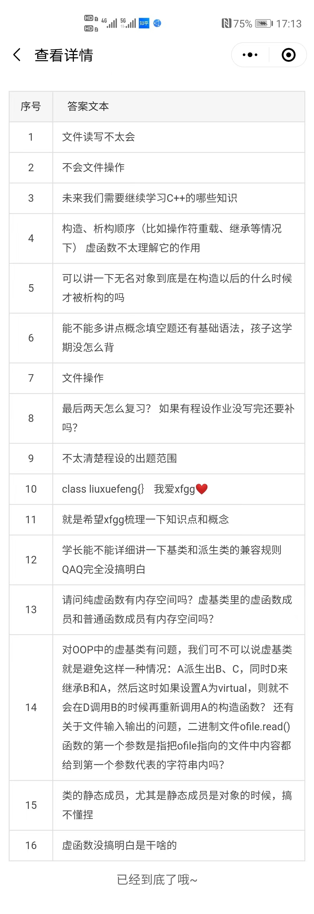

# Lecture

## 计算机程序设计基础 (2) 小班辅导 20230601

---

刘雪枫 - 无 92

Copyright (C) Timothy Liu 2023

许可证：[Creative Commons — 署名-相同方式共享 4.0 国际 — CC BY-SA 4.0](https://creativecommons.org/licenses/by-sa/4.0/deed.zh-Hans)

2023.06.01

---

## 目录

[TOC]

## 引（fei）言（hua）

<!-- 5min，活跃一下气氛 -->

我们先简单回顾一下程设（2）究竟要讲什么：一个是 C++，一个是面向对象。  

### C++

C++ 是一门支持面向对象特性的语言，支持多种编程范式（面向对象编程、面向过程编程、泛型编程、函数式编程、……）。被成为“C++ 之父”的 Bjarne Stroustrup 于 1979 年开始制作 C with class，后更名为 C++。下图即为传说中的~~发量惊人的~~[“C++ 之父”——Bjarne Stroustrup](https://www.stroustrup.com/)：  


C++ 目前由[国际标准委员会 ISO](https://www.iso.org/) 的 [WG21 工作组](https://isocpp.org/wiki/faq/wg21)进行标准化。1998 年第一个 C++ 标准（称作 C++98）被发布。目前 C++ 每三年发布一次新标准（[ISO 标准一般是十年，但由于语言出台新特性需要等十年过于久远，所以缩短为三年](https://github.com/Cpp-Club/Cxx_HOPL4_zh/blob/main/03.md)）。目前，[C++ 标准](https://www.iso.org/standard/79358.html)历经沧桑[已经或即将发布](https://www.open-std.org/JTC1/SC22/WG21/docs/standards)：  

| 发布年份 |               称呼                |                           备注                           |
| :------: | :-------------------------------: | :------------------------------------------------------: |
| 史前时期 | C with Classes / C++2.0 / 3.0、…… |         1. 版本很多；2. 我们的程设比这个先进一点         |
|   1998   |               C++98               |            第一个 ISO C++ 标准，至今仍有市场             |
|   2003   |               C++03               | C++98 的 bug 修复版本，改动不大，常不与 C++98 做特别区分 |
|   2011   |           C++11、C++0x            |           一次大的改动~~（一门新语言的诞生）~~           |
|   2014   |               C++14               |                    给 C++11 打补丁的                     |
|   2017   |               C++17               |                 本来想搞大的，但是拉胯了                 |
|   2020   |               C++20               |          一次大的改动~~（又一门新语言的诞生）~~          |
|   2023   |               C++23               | 给 C++20 打补丁的，马上要来了（将于 2023 年 12 月发布）  |
|   2026   |               C++26               |                          ？？？                          |

问：那咱们的程设是哪一个标准呢？  

答：咱们的程设是微软（Microsoft）发布的 VS2008“标准”（  

当然最接近的标准是 C++98 或 C++03

### 面向对象编程（OOP）

OOP 是一种**编程范式**，以类和对象作为编程的第一等公民。  

需要注意的是，C++ 支持面向对象的特性，但 C++ 支持面向对象特性特定并不等于面向对象。面向对象是一种编程的范式，或者说是一种代码的架构，和语言无关，[即使是 C 语言也可以进行面向对象编程](https://www.freetechbooks.com/object-oriented-programming-with-ansi-c-t551.html)，而 C++ 仅仅是从语法层面上为面向对象编程提供了便利，但使用 C++ 面向对象特性并不等于面向对象的程序设计。  

+ 什么是面向对象？
  + 基于对象（OB、Object-based、ADT、Abstract Data Type）的程序设计是将数据和对数据的操作封装到一起，称作”对象“，对外暴露一定的接口对该对象进行操作  
  + 面向对象（OO）是在基于对象的基础上，引入**继承、多态**等机制，通过各个类之间的复合、继承等关系，来组织代码结构。[面向对象设计模式](https://item.jd.com/41427811038.html)是一个基于面向对象思想组织代码的经验总结

## 2013 年与 2015 年考试试题讲解

**注：大体上都是照着考题原带的答案抄的，但考题原带的答案并不完全正确，对有问题的答案，本文档给予了适当说明**

不带 \* 的是 2013 年试题，带 \* 的是 2015 年试题

### 填空

填空题没什么好说的，背课件就完了（这里推荐 sjs 老师的课件，看起来相对比较规整）。

#### 1

面向对象程序设计有四个主要特点，即抽象、封装、（）和（）。

> 继承；多态
>
> > 如果是三个特点，可以不答”抽象“

#### 2

非成员函数应声明为类的（）函数才能访问这个类的 private 成员

> 友元
>
> > 友元：非成员、类似于“白名单”

#### 4

在用 class 定义一个类时，数据成员和成员函数的默认访问权限是（）。

> `private` / 私有
>
> > + `struct` 是 `public`
> > + 默认继承权限同理 <!--之后再说-->
> > + `struct` 与 `class` 除了默认的成员权限和继承权限之外是**完全等价**的

#### 4\*

在 `class B` 中定义成员函数 `int f1()` 和数据成员 `int a`；如果将函数 `f1()` 定义成静态成员函数，则定义式为（）；如果将 `a` 定义为静态数据成员，并在类外对其初始化为 `0`，则该语句为（）

> `static int f1();`；`int B::a = 0;`
>
> > 实际上题目表述有误，`static int f1();` 是声明而非定义；`int B::a = 0;` 是 `B::a` 的定义；只有声明而无没有定义而使用会产生链接错误
> >
> > 带 `const` 修饰可以只有声明而没有定义而取其值，但不能取指针也不能取引用（链接错误），具体原因参见[阅读材料 2](#阅读材料) 的关于 odr-use 的部分（但是这部分还没写，但愿暑假不会鸽 x）

#### 10

用 new 申请某一个类的动态对象数组时，在该类中必须能够匹配到（）的构造函数，否则应用程序会产生一个编译错误。  

> 没有形参 / 缺省参数  
>
> > 原因是 C++03 及之前使用 `new[]` 时不能给初值
> >
> > >  C++11 之后其实可以给。。。：`int *a = new int[2] { 9, 8 };`，但是没卵用 x

#### 6\*

有类 `A`，语句组 `A a(1), b; b = a;` 和语句 `A a(1), b(a);` 在生成对象 `b` 并用 `a` 赋初值时的差别是，后者（），而前者（）

> 调用 `b` 的复制构造函数，用 `a` 复制构造 `b`；先调用 `b` 的默认构造函数，再使用 `a` 对 `b` 赋值。  
>
> > 顾名思义，、、构造函数和复制构造函数都是在有新对象构造的时候才会调用。
> >
> > 复制构造函数：参数**绝大多数情况下必须**是 `const` 引用，**极少数情况**才会无 `const`。原因参见[阅读材料 2](#阅读材料)。  

#### 5

运算符重载函数可能是类的（）函数，也可以是类的（）函数，还可以是普通函数。  

> 成员；友元
>
> > + 举例 `complex`
> >
> > > 这题确定不是废话么 x
> > >
> > > zài zài zài（x

#### 8

重载的运算符保持其原有的（）、优先级和结合性不变

> 操作数个数

#### 10\*

运算符重载时需要保持运算符操作数的个数、运算符的执行（）和（）不变

> 结合性；优先级

#### 3

派生类中的成员不能直接访问基类中的（）成员

> 私有 / `private`
>
> > + 继承时，三种访问权限的直观理解，及存在意义
> >
> >   > 特殊用途：EBO、……
> >
> > + `struct` 默认是 `public` 继承

#### 9\*

公有继承下，派生类的成员函数可以直接访问基类的（）成员，但不能直接访问基类的（）成员

> `public` 和 `protected` / 公有和受保护的；`private`
>
> > 此题原答案有误，第一个空没考虑 `protected` 成员

#### 7\*

虚函数通常在相应的成员函数前加上（）关键字声明，此类函数的调用会延迟到（）时再进行动态束定（绑定），没有声明为 `virtual` 的成员函数则在编译时进行静态束定（绑定）

> `virtual`；运行
>
> > 构造函数中**不会呈现多态性**。为什么？构造函数执行顺序。为什么是这个执行顺序？反过来行不行？

#### 1\*

C++ 引入了函数重载和虚函数。其用途分别用一句话概括：函数重载是（）；虚函数是（）

> 通过静态束定，在编译时确定调用同名函数中的哪一个；通过动态束定，在程序运行时确定调用同名函数中的哪一个

#### 7

含有纯虚函数的类称为（）。

> 抽象类

#### 9

在 C++类中，有一种不能定义对象的类，这样的类只能被继承，称之为（），定义该类至少具有一个（）。

> 抽象类；纯虚函数

#### 8\*

包含纯虚函数的类被称为（），某类包含一个纯虚函数 `int fun()`，则该成员函数应声明为（）

> `int fun() = 0;`
>
> > 注：程设课上讲到的纯虚函数不能有函数体的说法其实是有误的，纯虚函数也可以定义函数体，但考试就当作不能（

#### 6

用流对象的成员函数控制输出格式时，用于设置字段宽度的流成员函数的名称是（），与之作用相同的控制符名称是（）。

> `width`、`setw`
>
> > + 只能死记硬背
> > + 自定义流操纵算子 <!-- 定义一个流操纵算子，输出 yuege -->

#### 5\*

在 C++ 程序中 `cin` 是在（）中定义的（）；`cout`、`cerr`、`clog` 三者的相同点是（）

> `iostream`；`输入流对象`（？）；`向标准输出设备输出`
>
> > 此题有误，`cerr` 和 `clog` 其实是向标准错误设备输出~~，所以它们其实共同点只有它们都是输出，但是为了考试拿分就这么答吧~~。
> >
> > 辨析 `cout`、`cerr`、`clog` 的区别：
> >
> > + `cout`：标准输出设备，有缓冲
> > + `clog`：标准错误设备，有缓冲
> > + `cerr`：标准错误设备，无缓冲

#### 3\*

C++ 程序中使用 `using namespace std;` 的原因是（），使用 `#include <iomanip>` 是因为（）

> 太长了懒得打字，参见原题上的答案

#### 2\*

C++ 中类和类模板的关系可以表述为：类是类模板的（），类模板是类的（）

> 实例；抽象（？）

### 编程填空

#### 2013

##### 1

```c++
virtual void show() const {
    cout << "Base" << endl;
}
```

```c++
virtual void show() const {	// virtual 可省
    cout << "Derived" << endl;
}
```

> 考察多态
>
> 原答案不加 `const` 也正确，但不够规范。原因参见[阅读材料 2](#阅读材料)。

##### 2

```c++
counter operator+(counter c)
/* 或 */
counter operator+(const counter& c)
```

```c++
return counter(n + c.n);
```

> 原答案第二个空也正确

##### 3

```c++
void show_time() const
```

```c++
cout << hour << ':' << minute << ':' << sec << endl;
```

> 原答案疑似 `const` 位置错误

##### 4

```c++
ifstream in("test.txt");
/* 或 */
ifstream in("test.txt", ios::in);
```

```c++
cout << i << ':' << buf << endl;
```

> 对于 `ifstream` 来说，构造函数第二个参数默认是 `ios::in` 

##### 5

```c++
virtual void Area() = 0;
```

> 这次**不能**写成 `Area() const`，因为 `Rectangle` 类的 `Area` 是非 `const` 的！

```c++
Rectangle(double w, double h) : width(w), height(h) {}
```

> 原答案为 `Rectangle(double w, double h) { width = w, height = h; }` 也正确

#### 补充

##### 1

```c++
class People
{
public:
    People(int age) : m_age(age) {}
private:
    int m_age;
};

class Student : public People
{
public:
    Student(int age, int id) ______ {}
private:
    int m_id;
};
```

> : People(age), m_id(id)

### 看程序写结果

+ 2013 年其他题参见试卷，懒得复制到这里了

+ 2013 年最后一题

  ```c++
  #include <iostream>
  #include <string>
  #include <cstring> // 原题忘了包含这个头文件了
  
  using namespace std;
  
  class Book {
      char* title;
      char* author;
      int numsold;
  
     public:
      Book() {}
      Book(const char* str1, const char* str2, const int num) {
          int len = strlen(str1);
          title = new char[len + 1];
          strcpy(title, str1);
          len = strlen(str2);
          author = new char[len + 1];
          strcpy(author, str2);
          numsold = num;
      }
      void setbook(const char* str1, const char* str2, const int num) {
          int len = strlen(str1);
          title = new char[len + 1];
          strcpy(title, str1);
          len = strlen(str2);
          author = new char[len + 1];
          strcpy(author, str2);
          numsold = num;
      }
      ~Book() {
          delete title;
          delete author;
      }
      void print(ostream& output) {
          output << "book:" << title << endl;
          output << "author:" << author << endl;
          output << "total:" << numsold << endl;
      }
  };
  
  void main() {
      Book obj1("Physics", "LiFu", 200), obj2;
      obj1.print(cout);
      obj2.setbook("C++ Programming", "SunJiasong", 300);
      obj2.print(cout);
  }
  ```

  > ```
  > book:Physics
  > author:LiFu
  > total:200
  > book:C++ Programming
  > author:SunJiasong
  > total:300
  > ```
  >
  > >  设计失误？Rule of three / five（三 / 五原则）！  

+ 2015 年 第三大题第 1 小题：

  ```cpp
  #include <iostream>
  using namespace std;
  
  int Num = 1;
  
  namespace Name1
  {
      int Num = 2;
      int Add(int Num)
      {
          Num = ::Num + Num;
          return Num;
      }
  }
  
  namespace Name2
  {
      int Num = 3;
      int Add(int Num)
      {
          Num = ::Num + Num;
          return Num;
      }
  }
  
  int main()
  {
      cout << Name1::Add(4) + ::Num << endl;
      cout << Name2::Add(5) + Num << endl;
      namespace N2 = Name1;
      cout << N2::Add(6) + N2::Num << endl;
      using namespace Name2;
      cout << Add(7) + Name2::Num << endl;
  }
  ```

  ```
  6
  7
  9
  11
  ```

+ 2015 年 第三大题第 3 小题

  题略

  ```
  2,3,3,4
  ```

+ 经典写构造函数和析构函数执行顺序的题，sjs 课件“C++程序设计(4)”26 页

  本题答案有争议。在不同的编译环境下，可能会产生截然不同的结果。但是为了考试拿分，还是严格按照课件给的答案进行。要了解更多内容，请阅读后面的[阅读材料 3](#阅读材料)  

  > + 请开启 VS、/std:c++14、/Od
  >
  > + 争议点
  >
  >   + 关于返回值优化
  >
  >   + 参数与返回值对象的析构顺序问题，构造时显然是先构造参数后构造返回值，至于析构，sjs 课件上是先析构参数后析构返回值，但一些其他的实现可能是先析构返回值后析构参数，例如 <https://gcc.godbolt.org/z/x8zjTKoMf>：
  >
  >     
  >
  >     实际上这个问题是有争议的，感兴趣的同学可以看这个问题下的“激烈讨论”：[c++ - What's the order of destruction of function parameters and return values? - Stack Overflow](https://stackoverflow.com/questions/76388464/whats-the-order-of-destruction-of-function-parameters-and-return-values)
  >
  >     大家最好是完全按照 sjs 上的讲义去写，不要头铁；我曾经发邮件问过 sjs 老师，sjs 老师给的邮件回复是“批改时我们会酌情考虑这些问题”。
  
  ```c++
  #include <iostream>
  using namespace std;
  class complex {
     public:
      complex(double r = 0.0, double i = 0.0) {
          this->r = r;
          this->i = i;
          cout << "Constructor!";
          display();
      }
  
      // 原题这里没有 const，我加上的
      complex(const complex& c) : r(c.r), i(c.i) {
          cout << "CopyConstructor!";
          display();
      }
      complex operator+(complex c2);
      complex operator-(complex c2);
      void display();
  
     private:
      double r;
      double i;
  };
  
  // 原题复制构造函数没有 const
  // 而对于这个函数来说直到 C++17 才允许这样过编译
  // 详情参见阅读材料 1、2 和 3，当然我也还没完全写完
  // 但在 VS2008 上居然能过编译
  // 可见 VS2008 是多么的高瞻远瞩（Doge）
  complex complex::operator+(complex c2) { return complex(r + c2.r, i + c2.i); }
  complex complex::operator-(complex c2) { return complex(r - c2.r, i - c2.i); }
  void complex::display() { cout << "(" << r << "," << i << ")" << endl; }
  int main() {                         // 主函数
      complex c1(5, 4), c2(2, 10), c3;  //
      cout << "c1=";
      c1.display();
      cout << "c2=";
      c2.display();
      c3 = c1 - c2;  //
      cout << "c3=c1-c2=";
      c3.display();
      c3 = c1 + c2;  //
      cout << "c3=c1+c2=";
    c3.display();
  }
  ```
  

## 面向对象程序设计（Optional）

面向对象程序设计原则（注意此处说的是面向对象，而非指 C++ 面向对象的语言特性）：  

+ 单一原则  
+ 开闭原则
+ 里氏替换原则（LSP）
+ 接口隔离原则
+ 依赖反转原则
+ ……

下面着重说一下里氏替换原则。  

### 里氏替换原则

**里氏替换原则：**派生类可以直接替换掉基类。即，任何一个派生类对象都“是”一个基类对象。这个“是”的含义代表，任何对基类对象的操作对派生类对象来说在逻辑上都成立。  

#### 反例 1

`Line` 继承 `Point` 不是一个好的设计。一个 `Line` 并不是一个 `Point`，不符合 LSP  

>  sjs 课件 (6) 77 页

#### 反例 2

下面所演示的 `Square` 继承 `Rectangle` 就不是一个好的设计：  

```c++

class Rectangle {
public:
    Rectangle(int width, int height) : width(width), height(height) {}
    int getWidth() const { return width; }
    int getHeight() const { return height; }
    void setWidth(int newWidth) { width = newWidth; }
    void setHeight(int newHeight) { height = newHeight; }

private:
    int width;
    int height;
};

class Square : public Rectangle {
public:
    Square(int edge) : Rectangle(edge, edge) {}
    int getEdge() const { return Rectangle::getWidth(); }
    void setEdge(int newEdge) {
        Rectangle::setWidth(newEdge);
        Rectangle::setHeight(newEdge);
    }
};
```

确实我们在日常生活中都说“正方形是一个长方形”，但是在本代码中并不是这样——因为我们对 `Square` 暴露了公有接口 `setWidth` 和 `setHeight`。如果我们执行了：`Square sq(10); sq.setWidth(88);`，那么就出现了问题——这个正方形长等于宽的性质被打破。也就是说，正方形并不能完全替代长方形，并不满足长方形所能进行的全部操作！所以这种设计思路是不符合里氏替换原则的。  

>  **特别注意**
>
> 里氏替换原则是面向对象的原则，而非 C++ 语法的规定。有一些情况，为了一些特殊的目的，会使用 C++ 语法上的“继承”，例如模板元编程、EBO，等等，都可能会使用 C++ 的继承语法。但这属于 C++ 语法的技巧，并不属于面向对象的程序设计范畴。  

### 面向对象程序设计？

设想我们有一个场景，我们要把大象装入冰箱中。分几步呢？分三步：把冰箱门打开，把大象装进去，把冰箱门关上。

## 编译、链接、多文件（Optional）

+ 预处理 -> 编译 -> 汇编 -> 链接 -> 执行  
+ MSVC、GCC、Clang（LLVM）  
  + cl、gcc、g++、clang  
+ 链接：静态链接、动态链接与运行时  
+ 多文件编程（声明与定义、Header Guard、Header Only）  
+ MSBuild、Makefile、Autotools、CMake

## Q & A

之前发的问卷，有些人问了一些问题

### 2023



### 2022

Q：怎么才算，面向对象的程序设计呢？那种大厂的游戏开发也是用这种类和对象来编程的吗？

A：

1. 面向对象程序设计思想通过我的一节课很难把它讲清楚，需要自己多阅读、尝试和练习
2. 面向对象只是组织代码方式的一种，也是一种经典的、传统的编程范式。代码当然可以采用其他的编程范式来组织。但是至少，目前最主流的两个游戏引擎：Unity 和 UE（Unreal Engine），都是通过面向对象来组织的。不过面向对象也不是万能的，还是要看具体用途。  

Q：可以加学长微信聊天吗？

A：可以，QQ 也行（x

## 阅读材料

由于课时原因，有很多有趣的内容我们都没有讲解。这些内容在程设的日常教学中已经涉及到，但是与考试关系不大。略去这些内容不会对我们的考试产生太大影响。有兴趣探索的同学可以阅读以下材料：  

所有阅读材料均在仓库 [https://github.com/Timothy-LiuXuefeng/tm-blogs](https://github.com/Timothy-LiuXuefeng/tm-blogs) 中可见，位于 `docs/zh-CN/c_cpp` 目录中。包括：  

1. 左值与右值
2. 为什么 `const` 在 C++ 中是重要的
3. 返回值优化

显然，目前我还没写完，先鸽一段时间（bushi

<font size=10>预祝同学们考试顺利（√）</font>

<font size=10>祝同学们儿童节快乐（bushi</font>

## QR Code

<font size=10>请同学们填写反馈问卷，谢谢大家！</font>

反馈问卷略。


## 参考文献

+ https://www.stroustrup.com/: 2022.05.28
+ https://github.com/Cpp-Club/Cxx_HOPL4_zh: 2022.05.28
+ https://en.wikipedia.org/wiki/C%2B%2B: 2022.05.28
+ https://zh.wikipedia.org/wiki/%E9%9D%A2%E5%90%91%E5%AF%B9%E8%B1%A1%E7%A8%8B%E5%BA%8F%E8%AE%BE%E8%AE%A1: 2022.05.28
+ 《深度探索 C++ 对象模型》Stanley B. Lippman 著，侯捷 译，电子工业出版社，2012 年 1 月 第 1 版
+ https://en.wikipedia.org/wiki/Object-based_language: 2022.05.28
+ https://en.cppreference.com/w/: 2022.05.28
+ *Clean C++*. Stephan Roth. (2017). New York: Springer Science+Business. 
+ 《复变函数与数理方程》课件，吴昊（男），2020

